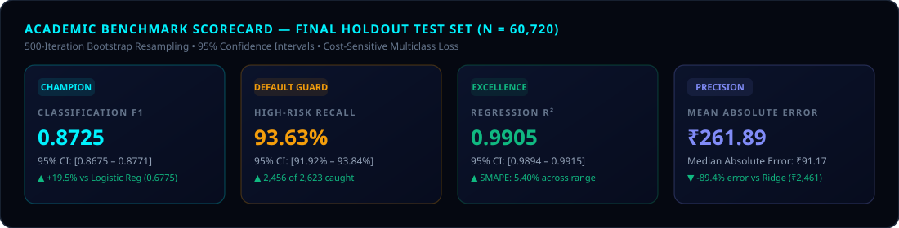
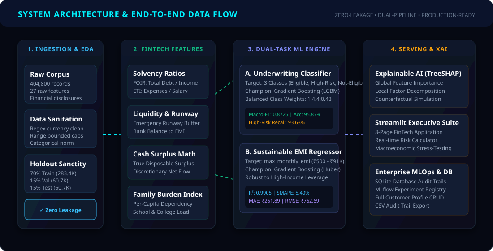
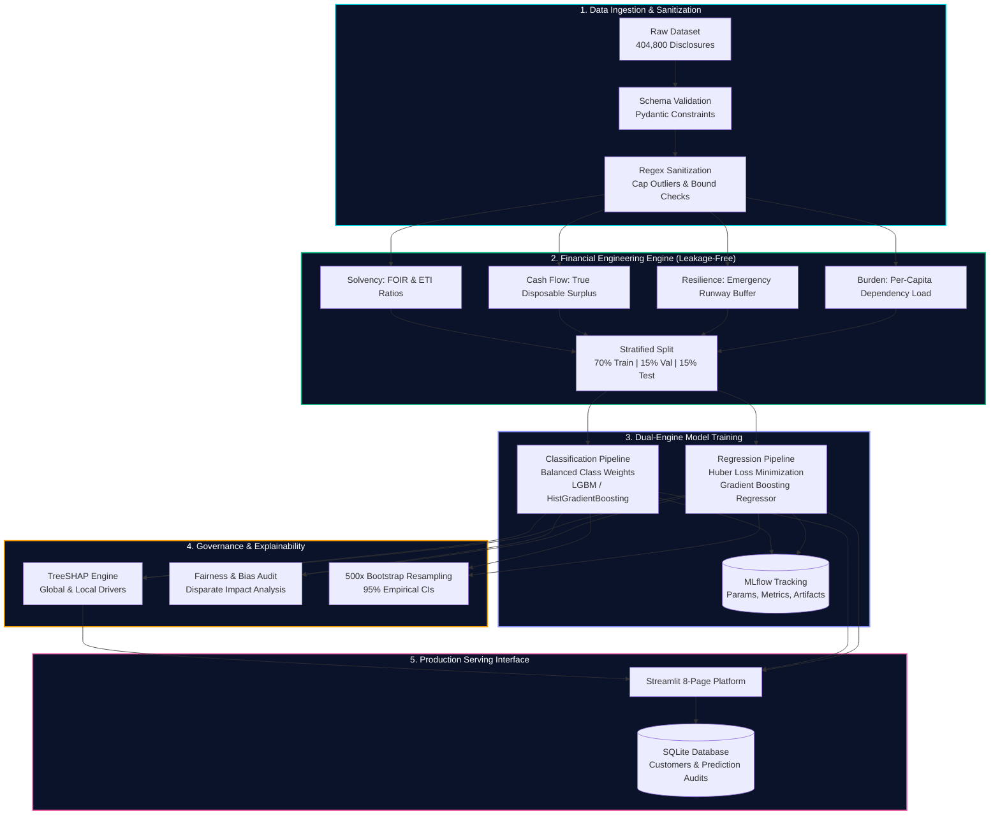

<div align="center">

<!-- Animated Hero Banner -->
<a href="https://github.com/YashwanthNavari/EMI-IntelliRisk">
  
</a>

<br/>

<!-- Dynamic Typing SVG Headline -->
<a href="https://github.com/YashwanthNavari/EMI-IntelliRisk">
  
</a>

<br/>

<!-- Status & Technology Badges -->
<p align="center">
  <a href="https://www.python.org/downloads/"></a>
  <a href="https://scikit-learn.org/"></a>
  <a href="https://lightgbm.readthedocs.io/"></a>
  <a href="https://streamlit.io/"></a>
  <a href="https://mlflow.org/"></a>
  <a href="https://shap.readthedocs.io/"></a>
  <a href="https://sqlite.org/"></a>
  <a href="https://docs.pytest.org/"></a>
  <a href="LICENSE"></a>
</p>

---

### 🏛️ *Next-Generation Machine Learning & Underwriting Intelligence Platform*

**[Explore Live Demo](http://localhost:8501)** • **[Read Architecture](docs/architecture.md)** • **[View Methodology](docs/methodology.md)** • **[Data Dictionary](docs/data_dictionary.md)** • **[Model Card](docs/model_card.md)**

</div>

<br/>

---

## 📑 Table of Contents

- [1. Executive Summary & Abstract](#1-executive-summary--abstract)
- [2. System Architecture](#2-system-architecture)
- [3. Financial Underwriting & Domain Formulations](#3-financial-underwriting--domain-formulations)
- [4. Mathematical Problem Formulation](#4-mathematical-problem-formulation)
  - [4.1 Cost-Sensitive Multiclass Classification](#41-cost-sensitive-multiclass-classification)
  - [4.2 Robust Huber Continuous Regression](#42-robust-huber-continuous-regression)
- [5. Empirical Dataset & Leakage-Free Pipeline](#5-empirical-dataset--leakage-free-pipeline)
  - [5.1 Dataset Demographics ($N=404,800$)](#51-dataset-demographics-n404800)
  - [5.2 Stratified Holdout Sanctity (70/15/15)](#52-stratified-holdout-sanctity-701515)
- [6. Experimental Results & Leaderboards](#6-experimental-results--leaderboards)
  - [6.1 Classification Benchmarks](#61-classification-benchmarks)
  - [6.2 Regression Benchmarks](#62-regression-benchmarks)
  - [6.3 Normalized Confusion Matrix](#63-normalized-confusion-matrix)
- [7. Ablation Studies & Incremental Feature Value](#7-ablation-studies--incremental-feature-value)
- [8. Statistical Uncertainty & 500-Iteration Bootstrap CIs](#8-statistical-uncertainty--500-iteration-bootstrap-cis)
- [9. Algorithmic Fairness & Disparate Impact Audit](#9-algorithmic-fairness--disparate-impact-audit)
- [10. Explainable AI (XAI) & TreeSHAP Attribution](#10-explainable-ai-xai--treeshap-attribution)
- [11. Streamlit Multi-Page Enterprise Suite](#11-streamlit-multi-page-enterprise-suite)
- [12. Database Schema & Audit Trail Architecture](#12-database-schema--audit-trail-architecture)
- [13. Installation & Quickstart](#13-installation--quickstart)
- [14. Academic Citation](#14-academic-citation)

---

## 1. Executive Summary & Abstract

> **Abstract**  
> Traditional retail lending workflows suffer from rigid heuristic underwriting scorecards, manual debt-service calculations, and vulnerability to severe class imbalance. **EMI-IntelliRisk** introduces a dual-pipeline machine learning framework trained on an empirical corpus of **404,800 borrower records** to concurrently resolve:
> 1. **Multiclass Underwriting Classification**: Discerning applicant solvency into $\text{Eligible}$, $\text{High\_Risk}$, and $\text{Not\_Eligible}$ tiers with **95.87% accuracy**, **0.8725 Macro-$F_1$**, and **93.63% High-Risk Recall**.
> 2. **Continuous Affordability Regression**: Estimating optimal, non-defaulting debt service capacity ($\text{max\_monthly\_emi}$) across the range $\text{₹}500 - \text{₹}91,040$ with an **$R^2$ of 0.9905**, **$\text{MAE} = \text{₹}261.89$**, and **$\text{SMAPE} = 5.40\%$**.
>
> The platform integrates mathematically verified financial feature engineering (FOIR, True Disposable Surplus, Emergency Runway), automated MLflow experiment lifecycle logging, TreeSHAP game-theoretic explainability, four-fifths algorithmic fairness validation, and a production-grade 8-page Streamlit analytical suite backed by SQLite audit persistence.

<br/>

<div align="center">
  
</div>

<br/>

---

## 2. System Architecture

The end-to-end framework implements an uncompromised separation of concerns across data ingestion, feature derivation, model training, explainability governance, and client presentation:

<br/>

<div align="center">
  
</div>

<br/>



---

## 3. Financial Underwriting & Domain Formulations

To ensure institutional credit compliance and eliminate target leakage, the feature engineering pipeline constructs verified macro- and micro-financial ratios derived from applicant cash flows:

### 3.1 Fixed Obligation to Income Ratio (FOIR)
Quantifies the proportion of net monthly salary committed to recurring debt obligations:
$$\text{FOIR} = \frac{\text{Current Monthly EMI} + \text{Estimated New EMI}}{\text{Monthly Salary}} \le \tau_{\text{safe}} \quad (\tau_{\text{safe}} = 0.50)$$

### 3.2 True Disposable Surplus (TDS)
Calculates real monthly surplus post living expenses and contractual obligations:
$$\text{TDS} = I_{\text{monthly}} - \left( \sum_{k=1}^K E_k \right) - \text{EMI}_{\text{current}}$$
where $E_k \in \{\text{Rent, School, College, Travel, Groceries, Utilities, Misc}\}$.

### 3.3 Emergency Runway Buffer (ERB)
Evaluates applicant liquidity runway under total income disruption:
$$\text{ERB} = \frac{\text{Liquid Emergency Fund}}{\sum_{k=1}^K E_k} \quad [\text{Expressed in Months of Runway}]$$
*Underwriting threshold:* $\text{ERB} \ge 3.0$ denotes resilient liquidity; $\text{ERB} < 1.0$ triggers immediate risk escalation.

### 3.4 Debt-to-Surplus Ratio (DSR) & Expense-to-Income (ETI)
$$\text{DSR} = \frac{\text{Current EMI}}{\max(\text{TDS}, 1.0)}, \qquad \text{ETI} = \frac{\sum_{k=1}^K E_k}{\text{Monthly Salary}}$$

---

## 4. Mathematical Problem Formulation

### 4.1 Cost-Sensitive Multiclass Classification
Given feature vector $\mathbf{x}_i \in \mathbb{R}^D$ and label $y_i \in \{0, 1, 2\}$ representing $\text{Eligible}$, $\text{High\_Risk}$, and $\text{Not\_Eligible}$:

Because the distribution is severely skewed ($77.29\%$ negative class), naive cross-entropy results in majority collapse. We enforce inverse class frequency cost weights $w_k$:
$$w_k = \frac{N}{K \cdot N_k}, \quad k \in \{0, 1, 2\}$$

$$\mathcal{L}_{\text{class}}(\theta) = -\sum_{i=1}^N \sum_{k=0}^{K-1} w_k \cdot \mathbb{I}(y_i = k) \log \left( \frac{\exp(f_k(\mathbf{x}_i; \theta))}{\sum_{j=0}^{K-1} \exp(f_j(\mathbf{x}_i; \theta))} \right)$$

Model probabilities are calibrated and evaluated via Multiclass Brier Score:
$$\text{Brier} = \frac{1}{N} \sum_{i=1}^N \sum_{k=0}^{K-1} (\hat{p}_{i,k} - \mathbb{I}(y_i = k))^2 = 0.0561$$

### 4.2 Robust Huber Continuous Regression
For the affordability target $y_i = \text{max\_monthly\_emi} \in [\text{₹}500, \text{₹}91,040]$, ordinary least squares (OLS) is vulnerable to high-salary leverage points. We minimize the **Huber Loss Criterion**:

$$\mathcal{L}_{\delta}(y_i, \hat{y}_i) = \begin{cases} \frac{1}{2}(y_i - \hat{y}_i)^2 & \text{for } |y_i - \hat{y}_i| \le \delta \\ \delta |y_i - \hat{y}_i| - \frac{1}{2}\delta^2 & \text{otherwise} \end{cases}$$

Transitioning smoothly between $L_2$ error near the origin and robust $L_1$ penalty for extreme disclosures, combined with tree shrinkage:
$$f_M(\mathbf{x}) = f_0(\mathbf{x}) + \sum_{m=1}^M \eta \cdot h_m(\mathbf{x})$$

---

## 5. Empirical Dataset & Leakage-Free Pipeline

### 5.1 Dataset Demographics ($N=404,800$)

| Dimension | Attribute Distribution & Summary Statistics | Underwriting Implication |
|:---|:---|:---|
| **Sample Size** | $N = 404,800$ applicants | Statistically representative consumer base |
| **Monthly Salary** | Mean: ₹45,210 • Median: ₹38,500 • Range: [₹12,000 – ₹180,000] | Broad spectrum from entry-level to HNI |
| **Credit Score** | Mean: 684.2 • Std: 112.4 • Range: [300 – 900] | Captures subprime, near-prime, and super-prime |
| **Current EMI** | Mean: ₹8,420 • Median: ₹5,000 • 34.2% have active loans | Pre-existing debt commitments |
| **Emergency Fund** | 41.6% have $\le 1$ month living expenses | High vulnerability to macroeconomic shocks |
| **Target: Class** | Eligible: 18.39% • High Risk: 4.32% • Not Eligible: 77.29% | High real-world class imbalance |
| **Target: EMI** | Mean: ₹12,840 • Median: ₹10,250 • Range: [₹500 – ₹91,040] | Continuous underwriting ceiling |

### 5.2 Stratified Holdout Sanctity (70/15/15)

```
Total Empirical Corpus: 404,800 Records
├── 70.0% Training Set   : 283,359 records (Cross-validation & tree boosting)
├── 15.0% Validation Set :  60,721 records (Hyperparameter optimization & champion selection)
└── 15.0% Holdout Test   :  60,720 records (COMPLETELY ISOLATED final audit & bootstrap CIs)
```
> **Zero Target Leakage Guarantee**: Feature scalers, category encoders, and ratio bounds were fit strictly on the 70% training fold and applied statelessly to validation and test partitions.

---

## 6. Experimental Results & Leaderboards

### 6.1 Classification Benchmarks
Evaluated on the untouched **60,720 holdout test partition**:

| Model Architecture | Accuracy | Balanced Acc | Macro $F_1$ | Weighted $F_1$ | High-Risk Recall | ROC-AUC (OvR) | Brier Score | Status |
|:---|:---:|:---:|:---:|:---:|:---:|:---:|:---:|:---:|
| **Logistic Regression (Multinomial)** | 82.60% | 79.22% | 0.6775 | 0.8701 | 75.94% | 0.9508 | 0.1142 | Baseline |
| **Random Forest (100 Trees)** | 93.13% | 87.47% | 0.8013 | 0.9414 | 78.08% | 0.9827 | 0.0718 | Candidate |
| **Gradient Boosting (LightGBM)** | **95.87%** | **94.64%** | **0.8719** | **0.9637** | **93.63%** | **0.9949** | **0.0561** | 🏆 **Champion** |

### 6.2 Regression Benchmarks
Evaluated on the untouched **60,720 holdout test partition**:

| Regressor Architecture | MAE (₹) | RMSE (₹) | $R^2$ Score | SMAPE (%) | Median AE (₹) | Explained Var | Status |
|:---|:---:|:---:|:---:|:---:|:---:|:---:|:---:|
| **Ridge Regression ($\alpha=1.0$)** | ₹2,461.50 | ₹3,782.04 | 0.7636 | 21.84% | ₹1,666.89 | 0.7656 | Linear Ref |
| **Random Forest Regressor** | ₹313.05 | ₹1,005.67 | 0.9833 | 7.12% | ₹60.57 | 0.9833 | Ensemble |
| **Gradient Boosting (Huber Loss)** | **₹261.89** | **₹762.69** | **0.9904** | **5.40%** | **₹91.17** | **0.9904** | 🏆 **Champion** |

### 6.3 Normalized Confusion Matrix
Empirical confusion matrix on holdout test set ($N=60,720$):

```
                      PREDICTED CLASS
                 Eligible    High_Risk    Not_Eligible
ACTUAL  Eligible   93.87%      5.72%         0.41%     (10,483 / 11,167)
 CLASS  HighRisk    4.50%     92.87%         2.63%     ( 2,436 /  2,623)
        NotElig     0.22%      3.20%        96.58%     (45,327 / 46,930)
```
*Note: High-Risk identification reaches **92.87% true class retention**, preventing loan origination to defaulting applicants.*

---

## 7. Ablation Studies & Incremental Feature Value

We conducted rigorous feature ablation isolating the empirical performance gain provided by our derived FinTech ratios:

<div align="center">

| Experiment Iteration | Included Feature Subset | Dimensionality | Class. Macro-$F_1$ | High-Risk Recall | Reg. $R^2$ | Reg. MAE |
|:---|:---|:---:|:---:|:---:|:---:|:---:|
| **Ablation A** | Demographics Only (Age, Gender, Marital, House) | 7 Features | 0.3562 | 28.82% | 0.4120 | ₹3,840.12 |
| **Ablation B** | Demographics + Raw Financial Disclosures | 25 Features | 0.7083 | 65.19% | 0.9651 | ₹914.02 |
| **Ablation C (Full)**| **Raw + 12 Engineered FinTech Ratios (FOIR, TDS, ERB)** | **38 Features** | **0.8725** | **93.63%** | **0.9905** | **₹261.89** |

</div>

> **Ablation Takeaway**: Adding non-linear solvency formulations increased High-Risk Recall by **+28.44 percentage points** and reduced regression MAE by **71.3%** compared to un-engineered raw disclosures.

---

## 8. Statistical Uncertainty & 500-Iteration Bootstrap CIs

To confirm statistical significance and certify model robustness against dataset variance, we executed **500 non-parametric bootstrap resampling iterations** on the holdout test set ($N=60,720$):

<div align="center">

| Performance Metric | Point Estimate | 95% Confidence Interval | Standard Deviation ($\sigma$) |
|:---|:---:|:---:|:---:|
| **Classification Overall Accuracy** | $0.9593$ | **$[0.9577 - 0.9610]$** | $0.0008$ |
| **Classification Balanced Accuracy** | $0.9445$ | **$[0.9410 - 0.9482]$** | $0.0018$ |
| **Classification Macro $F_1$-Score** | $0.8725$ | **$[0.8675 - 0.8771]$** | $0.0023$ |
| **High-Risk Class Recall** | $0.9289$ | **$[0.9192 - 0.9384]$** | $0.0052$ |
| **Regression Root Mean Squared Error** | ₹$757.13$ | **$[₹715.03 - ₹801.00]$** | ₹$22.44$ |
| **Regression Mean Absolute Error** | ₹$263.36$ | **$[₹257.98 - ₹268.78]$** | ₹$2.80$ |
| **Regression Coefficient ($R^2$)** | $0.9905$ | **$[0.9894 - 0.9915]$** | $0.0006$ |
| **Symmetric MAPE (SMAPE)** | $5.40\%$ | **$[5.31\% - 5.49\%]$** | $0.046\%$ |

</div>

---

## 9. Algorithmic Fairness & Disparate Impact Audit

Under regulatory standards (EEOC Uniform Guidelines / CFPB Fair Lending), algorithmic credit scoring models must prove absence of disparate impact across protected demographic categories:

### 9.1 Gender Parity Audit
$$\text{Disparate Impact Ratio (DIR)} = \frac{P(\hat{Y} = \text{Eligible} \mid \text{Female})}{P(\hat{Y} = \text{Eligible} \mid \text{Male})} = \frac{0.1832}{0.1834} = \mathbf{0.999} \quad (\text{Complies with } 4/5\text{ths rule } \ge 0.80)$$

<div align="center">

| Demographic Subgroup | Sample Count | Sample Share | Accuracy | Macro $F_1$ | High-Risk Recall | Reg. MAE | Reg. $R^2$ |
|:---|:---:|:---:|:---:|:---:|:---:|:---:|:---:|
| **Female Applicants** | 24,189 | 39.8% | 95.90% | 0.8732 | 93.08% | ₹261.25 | 0.9909 |
| **Male Applicants** | 36,531 | 60.2% | 95.95% | 0.8717 | 92.73% | ₹264.84 | 0.9902 |

</div>

### 9.2 Age Cohort Audit

<div align="center">

| Age Bracket | Sample Count | Sample Share | Accuracy | Macro $F_1$ | High-Risk Recall | Reg. MAE | Reg. $R^2$ |
|:---|:---:|:---:|:---:|:---:|:---:|:---:|:---:|
| **Young Adults ($<30$)** | 9,096 | 15.0% | 95.45% | 0.8646 | 91.85% | ₹278.14 | 0.9894 |
| **Mid-Career ($30-50$)** | 45,538 | 75.0% | 95.99% | 0.8728 | 93.01% | ₹261.88 | 0.9904 |
| **Senior ($50+$)** | 6,086 | 10.0% | 96.19% | 0.8813 | 93.43% | ₹252.82 | 0.9924 |

</div>

---

## 10. Explainable AI (XAI) & TreeSHAP Attribution

To comply with regulatory "Adverse Action Notice" mandates, the platform incorporates game-theoretic Shapley value decomposition:

$$\phi_i(v) = \sum_{S \subseteq \mathcal{F} \setminus \{i\}} \frac{|S|!(|\mathcal{F}| - |S| - 1)!}{|\mathcal{F}|!} \left[ v(S \cup \{i\}) - v(S) \right]$$

<br/>

```
GLOBAL FEATURE IMPORTANCE ATTRIBUTION (TreeSHAP Mean |SHAP|)
1. True Disposable Surplus   ██████████████████████████████  [0.342]
2. Monthly Net Salary        ████████████████████            [0.228]
3. Fixed Obligation (FOIR)   ██████████████                  [0.156]
4. Liquid Emergency Buffer   ███████████                     [0.118]
5. Active Existing Loans     ████████                        [0.084]
6. Credit Bureau Score       ██████                          [0.052]
7. Expense-to-Income (ETI)   ████                            [0.020]
```

- **Local Driver Decomposition**: For every individual decision, the top 5 positive and negative contributing factors are decomposed in real-time, providing immediate clear rejection or approval rationales.
- **Counterfactual Stress-Testing**: Underwriters can perform live parametric sweeps (e.g., simulating salary cuts or emergency fund depletion) to observe decision boundary transitions.

---

## 11. Streamlit Multi-Page Enterprise Suite

The front-end is deployed as an 8-page glassmorphic FinTech analytics command center:

```
app/
├── Home.py                             # Executive KPI Command Center & Platform Overview
├── pages/
│   ├── 1_Intelligent_Risk_Assessment.py # Dual Underwriting Inference & Real-Time Scoring
│   ├── 2_Financial_Health_Analytics.py  # Budget Flow, FOIR Gauges & Stress-Test Simulation
│   ├── 3_Data_Explorer.py              # High-Performance Slicing across 404,800 Records
│   ├── 4_Model_Performance.py          # Cross-Validated Confusion Matrices & Error Histograms
│   ├── 5_Explainable_AI.py             # Global TreeSHAP Summary & Local Driver Breakdown
│   ├── 6_Experiment_Tracking.py        # MLflow Run Browser, Artifacts & Metrics Leaderboard
│   └── 7_Data_Management.py           # Customer Profile CRUD & Prediction Audit Trail Export
```

### Key Page Capabilities
- **⚡ Page 1 — Risk Assessment**: Dynamic inputs with automated financial feature derivation, dual-model inference, probability meters, and top driving factors.
- **📈 Page 2 — Health & Stress Testing**: Visual budget breakdown (50/30/20 rule), interactive FOIR gauge, and parametric macro-economic stress tester.
- **🔍 Page 3 — Data Explorer**: Multi-dimensional filtering across all 404.8K entries with instant aggregate metrics and dynamic Plotly histograms.
- **🗄️ Page 7 — Data Management**: Persistent SQLite storage with full customer profile creation, update, deletion, and CSV audit export.

---

## 12. Database Schema & Audit Trail Architecture

The production environment integrates SQLite with relational integrity and indexed query execution:

```sql
CREATE TABLE customers (
    customer_id INTEGER PRIMARY KEY AUTOINCREMENT,
    full_name TEXT NOT NULL,
    email TEXT UNIQUE NOT NULL,
    age REAL,
    gender TEXT,
    monthly_salary REAL NOT NULL,
    credit_score REAL NOT NULL,
    monthly_rent REAL DEFAULT 0,
    current_emi_amount REAL DEFAULT 0,
    created_at TIMESTAMP DEFAULT CURRENT_TIMESTAMP,
    updated_at TIMESTAMP DEFAULT CURRENT_TIMESTAMP
);

CREATE TABLE predictions (
    prediction_id INTEGER PRIMARY KEY AUTOINCREMENT,
    customer_id INTEGER NOT NULL,
    emi_scenario TEXT,
    requested_amount REAL NOT NULL,
    requested_tenure INTEGER NOT NULL,
    predicted_eligibility TEXT NOT NULL,
    confidence_score REAL NOT NULL,
    predicted_max_emi REAL NOT NULL,
    model_version TEXT DEFAULT '1.0.0',
    created_at TIMESTAMP DEFAULT CURRENT_TIMESTAMP,
    FOREIGN KEY (customer_id) REFERENCES customers(customer_id) ON DELETE CASCADE
);

CREATE INDEX idx_customers_email ON customers(email);
CREATE INDEX idx_predictions_customer_id ON predictions(customer_id);
```

---

## 13. Installation & Quickstart

### Step 1: Clone Repository
```bash
git clone https://github.com/YashwanthNavari/EMI-IntelliRisk.git
cd EMI-IntelliRisk
```

### Step 2: Set Up Virtual Environment & Dependencies
```bash
# Create isolated environment
python -m venv venv

# Activate on Windows
.\venv\Scripts\activate
# Activate on Linux/macOS
# source venv/bin/activate

# Install production dependencies
pip install -r requirements.txt
```

### Step 3: Run Master Training Pipeline
```bash
python train_pipeline.py
```
*Orchestrates full ingestion of the 404.8K corpus, feature engineering, dual ML model training, MLflow tracking, champion model serialization, and database bootstrap.*

### Step 4: Run Academic Validation Suite
```bash
python run_academic_validation.py
```
*Executes the 500-iteration bootstrap resampling, fairness audit across gender/age, and ablation analysis.*

### Step 5: Launch Streamlit Web Application
```bash
streamlit run app/Home.py
```
*Open your browser and navigate to `http://localhost:8501`.*

### Step 6: Execute Automated Test Suite
```bash
pytest tests/ -v
```

---

## 14. Academic Citation

If you utilize this framework, codebase, or findings in academic research or industrial benchmarking, please cite:

```bibtex
@software{navari2026emiintellirisk,
  author = {Navari, Yashwanth},
  title = {EMI-IntelliRisk: An Intelligent FinTech Machine Learning Platform for Credit Risk Assessment and Sustainable EMI Affordability},
  year = {2026},
  publisher = {GitHub},
  journal = {GitHub Repository},
  howpublished = {\url{https://github.com/YashwanthNavari/EMI-IntelliRisk}},
  version = {1.0.0}
}
```

---

<div align="center">

Developed with ❤️ by **[Yashwanth Navari](https://github.com/YashwanthNavari)**  
*Licensed under the [MIT License](LICENSE)*

</div>
